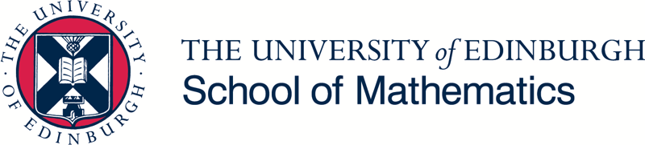

#  Object-Oriented Programming with Applications syllabus

***Acknowledgement: This is a fork of [advanced-js syllabus](https://github.com/advanced-js/syllabus). If you are a teacher or interested in the design of the course, see the [meta](https://github.com/advanced-js/syllabus/blob/gh-pages/meta.md) document in the original repository.***

* **Course:** [MATH11152](http://www.drps.ed.ac.uk/18-19/dpt/cxmath11152.htm)
* **Course organiser:** Dr Goncalo Dos Reis, [g.dosreis@ed.ac.uk](mailto:g.dosreis@ed.ac.uk)
* **Lecturer:** Witold Gawlikowicz, [v1wgawli@ed.ac.uk](mailto:v1wgawli@ed.ac.uk)
* **Teaching assistants and course secretary:** Please refer to course's [Learn page](https://www.learn.ed.ac.uk/webapps/blackboard/content/listContentEditable.jsp?content_id=_3041284_1&course_id=_64789_1)
* **Office hours:** The lecturer and one teaching assistant will be available in the lab room after the lab (Wednesdays 6-7pm)
* **Discussion:** If you'd like to discuss anything to do with the course you can write a message on Gitter (please note these are publicly visible, student only rooms will be created in due course)
   * 
* **Bugs/Suggestions:** If you find any bugs in this syllabus or would like to make a suggestions please raise an [issue](https://github.com/OOPA2018/syllabus/issues) (GitHub account required)
* **Updates:** The syllabus will be updated to include links to lectures and problem sheets as they get released. Minor modifications may also happen. Please [watch it](https://help.github.com/articles/watching-and-unwatching-repositories/) to get notified of any changes (GitHub account requried)

## Course Description

It is a fast-paced **level 11** postgraduate course starting from C#/.NET basics and quickly moving to more advanced object-oriented concepts and applications spanning numerical methods, computational mathematics and quantitative finance. 

While it's an assignment-only course, the workload is quite heavy and every year a few students fail this course. You will need to make sure you work through the tutorial sheets and lecture material regularly to clear-up any doubts as they come up and make the most of the teaching staff's help before heading off to work on the main project during the winter teaching vacation.

## Prerequisites / Warning 
* At least one semester of an undergraduate course dedicated to programming (in any language). Understanding of flow control, methods/functions and some basics of data structures. This requirement is for both UG students and PGT students from MSc programmes other than MSc Computational Mathematical Finance.

* This must **not be** your first programming course.  You should have done at least one semester of programming (using Matlab or R to draw some graphs doesn’t count).

* This course is demanding as:
  * you need to know computational mathematics (nonlinear solvers, numerical integration, Monte-Carlo, finite difference PDE solvers, optimization), it is **assumed** that you know most of this from your undergraduate studies
  * you need to know or like mathematical finance & derivative pricing 
  * you need to learn a new programming language – C#
  * you will need to a lot of time to work through the assignments

* Consider [Python Programmin](http://www.drps.ed.ac.uk/18-19/dpt/cxmath11199.htm) or [Scientific Computing](http://www.drps.ed.ac.uk/18-19/dpt/cxmath11198.htm) for a course at a slower pace

## Learning outcomes
It is intended that students will demonstrate:
 * appropriate use of flow-control, encapsulation and data-types
 * understanding of basic concepts of object oriented programming: 
   * classes / objects
   * inheritance
   * interfaces
 * ability to implement some numerical methods 
   * root finding
   * numerical integration
   * finite-difference
   * Monte-Carlo
 * use of good programming style and writing of code that is:
   * reliable
   * extendible 
   * reusable 
 * familiarity with modern software-development tools including:
   * source control
   * unit testing
   * continous integration server
  
by constructing relevant algorithms in labs / assignments
## How to succeed?
No-one has learned programming by reading books or attendinglectures alone!

You can only learn programming by actually coding up solutions to problems yourself:
  * Do write the code even when the exercise seems trivial
    * Does it compile?  
    * Does it run as expected?  
    * Can you make it more efficient?  
    * Will the code be understandable to someone else?
    * Yoursef in a months time?
  
Speak with others and discuss but do not copy directly:
  * Don’t neglect the collaborative aspect - most of the professional development is done in teams.

Consult [learning materials](#learning-materials) when you're stuck or need to clarify some concepts, **but** always prioritise coding-time when studying - don't fool yourself that you're learning to code by reading lecture notes or a book on C# for two hours without touching the keyboard even once.

## Homeworks/Project

All assignments are listed within the [Course Outline](#course-outline).

## Course Outline

### Week 1
  * **No lectures or labs**
  * Please familiarise yourself with the rest of the syllabus along with the lecture material and problem sheet for week 2
  * Setup a [GitHub](https://github.com/) account as we will be using it for assignments

### Week 2
1. [Lecture 1](https://github.com/OOPA2018/Lecture-1/blob/master/Lecture1.pdf)
   * Visual Studio introduction
   * Hello World!
1. [Lecture 2](https://github.com/OOPA2018/Lecture-2/blob/master/Lecture2.pdf)
   * Basic types, flow control (if / else) and methods 
   * Scope of a variable
   * Compiler is your friend
1. [Lab](https://github.com/OOPA2018/Problem-sheets/blob/master/ProblemSheet1.pdf)

### Week 3
1. Lecture 3
   * Object-Oriented Programming concepts
      * Objects, types, classes, methods, properties
      * Encapsulation
      * Inheritence
      * Static methods and classes
1. Lecture 4
   * Exceptions
   * Data structures
   * Basic algorithm complexity
   * What makes a good code?
1. Lab

### Week 4
1. Lecture 5
   * Using libraries
    * Referencing other projects in solution
    * NuGet package manager
    * Closer look at a few libraries
1. Lecture 6
   * Excel integration
   * Debugging
   * Summary of the first 3 weeks of the course

### Week 5
1. Lecture 7
   * Source control
   * Lab problem sheet overview
1. Lab
1. Lab

  `Assignment 1 announced`

### Week 6
1. Lecture 8
    * Importannce of testing, unit tests
    * Lab problem sheet overview
1. Lab
1. Lab

### Week 7
  `Assignment 1 due on Monday at noon`
1. Lecture 9
    * C# style
    * Lab problem sheet overview
1. Lab
1. Lab

  `Assignment 2 announced`
 
### Week 8
1. Lecture 10
    * S.O.L.I.D design principles
    * Lab problem sheet overview

### Week 9
  `Assignment 2 due on Monday at noon`
1. Lecture 11
    * Open to suggestions on more advanced programming concepts students may be insterested in
    * Lab problem sheet overview

  `Final project published`

### Week 10
1. Lecture 12
    * Final project overview and discussion

### Semester 2, Week 1
  `Final project due on Monday at noon`

## Resources

### Tools

#### [Visual Studio 2017](https://visualstudio.microsoft.com/downloads/)
   * The free Community version will be enough for the purposes of this course

#### Git and GitHub
   * [Github extension for Visual Studio](https://visualstudio.github.com/)
   * [Official GitHub Help](https://help.github.com/)
    
### Learning materials

#### Books 

 * [Wright, P. *Beginning Visual C# 2005 Express Edition*](https://discovered.ed.ac.uk/primo-explore/fulldisplay?docid=TN_springer_s978-1-4302-0167-0_124533&context=PC&vid=44UOE_VU2&search_scope=default_scope&tab=default_tab&lang=en_US)
 * [Duffy, D. J. and Germani, A. *C# for Financial Markets*](https://discovered.ed.ac.uk/primo-explore/fulldisplay?docid=44UOE_ALMA51161114570002466&context=L&vid=44UOE_VU2&search_scope=default_scope&tab=default_tab&lang=en_US)
 * Many other books on C# available via [DiscoverEd](https://discovered.ed.ac.uk), have a look

#### Online resources
  * [Offical C# guide from Microsoft](https://docs.microsoft.com/en-us/dotnet/csharp/)
  * [stackoverflow](https://stackoverflow.com/questions/tagged/c%23)

## Grading

* Assignment 1 - 5%
* Assignment 2 - 15%
* Final Project – 80%

## Plagiarism
Please familiarise yourself with the university guideliness on [avoiding plagiarism](https://www.ed.ac.uk/academic-services/students/conduct/academic-misconduct/plagiarism). 

